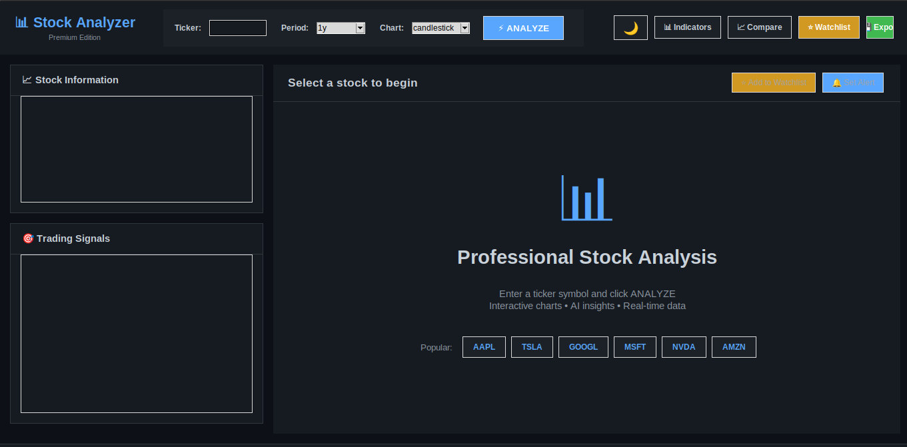
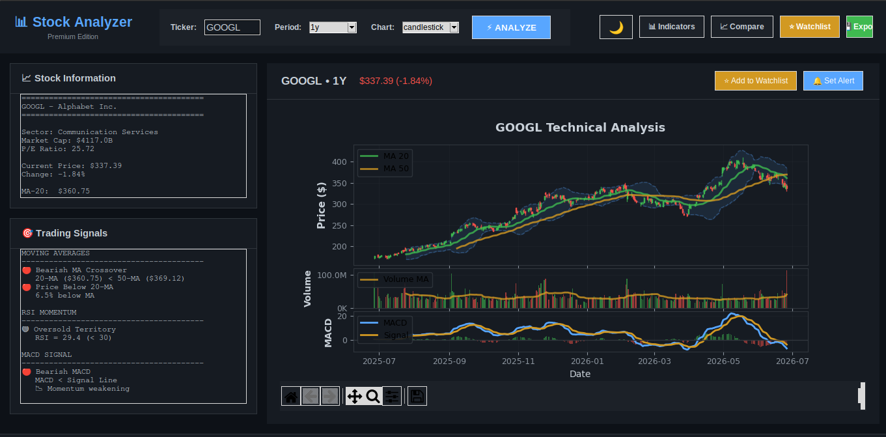
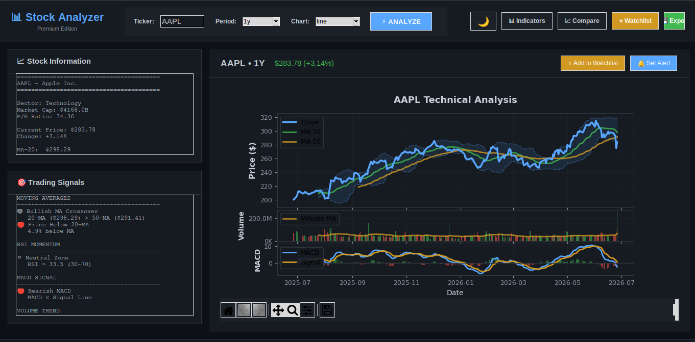

<div align="center">

# Stock Analyzer Pr

### A Professional Desktop Application for Quantitative Technical Analysis

[](https://python.org)
[](LICENSE)
[](https://github.com/kermitthedev/stock-analyzer)
[](https://pypi.org/project/yfinance/)
[](https://github.com/kermitthedev/stock-analyzer)

**Real-time market data · 7+ technical indicators · AI-powered signals · Interactive charts**

[Features](#features) · [Installation](#installation) · [Usage](#usage) · [Technical Indicators](#technical-indicators) · [Architecture](#architecture)

</div>

<br>

<div align="center">
  
  
  
</div>

<br>

## Overview

Stock Analyzer Pro is a full-featured desktop application for technical stock market analysis built entirely in Python. It provides traders and researchers with real-time market data, interactive candlestick charts, and a composite signal scoring engine that synthesizes multiple technical indicators into actionable buy/sell/hold recommendations.

All seven technical indicators (RSI, MACD, Bollinger Bands, MA-20, MA-50, MA-200, Volume MA) are implemented from scratch using `pandas` and `NumPy` with no external TA libraries. The application uses a multi-threaded architecture to keep the UI responsive during API calls and supports live data across nine configurable timeframes (1D to 5Y).

<br>

## Features

### Market Data and Charting

| Feature | Description |
|---|---|
| Candlestick Charts | OHLC candlesticks with color-coded bodies and wicks rendered using matplotlib `Rectangle` patches |
| Interactive Navigation | Zoom, pan, and reset via `NavigationToolbar2Tk` integration |
| Hover Tooltips | Real-time crosshair with full data readout: Date · Open/High/Low/Close · Volume · RSI · MACD |
| Volume Overlay | Color-synced bars (green = up day, red = down day) with 20-day volume MA |
| Multi-Timeframe | Quick-access period buttons: 1W · 1M · 3M · 6M · 1Y · 2Y · 5Y |
| Compare Mode | Normalized percentage performance overlay for multiple tickers simultaneously |

### Technical Analysis Engine

| Indicator | Parameters | Implementation |
|---|---|---|
| RSI | Period: 5-50 (default 14) | Wilder smoothing via `pandas.rolling()` |
| MACD | Fast 12, Slow 26, Signal 9 | Triple EMA via `pandas.ewm()` |
| Bollinger Bands | Period: 10-50, Std: 1-3 (default 20, 2 sigma) | SMA +/- N x rolling std |
| MA-20 | Period: 5-200 (adjustable) | Simple rolling mean |
| MA-50 | Period: 10-200 (adjustable) | Simple rolling mean |
| MA-200 | Period: 50-300 (adjustable) | Simple rolling mean |
| Volume MA | 20-day | Rolling mean on volume series |

### Recommendation Engine

- Composite scoring model combining five weighted signals: MA crossover, price vs MA, RSI zone, MACD crossover, and volume confirmation
- Score range of -10 to +10 maps to Strong Sell / Sell / Hold / Buy / Strong Buy
- Dynamic text summaries generated from rule-based signal logic producing natural-language market insights
- Automatic resistance and support detection from Bollinger Band upper and lower extremes

### UI and UX

- Dual theme system: dark (`#0d1117`) and light (`#ffffff`) with instant switching
- Card-based layout with bordered sections and consistent padding
- Monospace font for numerical data; sans-serif for UI labels
- Color-coded signal indicators: green for bullish, red for bearish, gray for neutral

### Data Management

- Persistent watchlist backed by `watchlist.json` with starred, tracked, and alert-set states
- Price alert framework with above/below targets stored in `alerts.json`
- Export suite: PNG chart at 300 DPI, TXT analysis report, and CSV with all computed indicator columns

<br>

## Installation

### Prerequisites

Python 3.8 or higher is required. Download it at [python.org](https://www.python.org/downloads/).

Verify that `tkinter` is available:

```bash
python -c "import tkinter; tkinter._test()"
```

A small window should appear confirming that Tkinter is working. If it is missing on Linux, install it with:

```bash
sudo apt-get install python3-tk python3-pil.imagetk
```

### Option 1: Clone and Run (Recommended)

```bash
# Clone the repository
git clone https://github.com/kermitthedev/stock-analyzer.git
cd stock-analyzer

# Create and activate a virtual environment
python3 -m venv stock_env
source stock_env/bin/activate        # Linux and macOS
# stock_env\Scripts\activate         # Windows

# Install dependencies
pip install -r requirements.txt

# Launch the application
python3 stock_analyzer_gui.py
```

### Option 2: Manual Dependency Install

```bash
pip install yfinance pandas matplotlib numpy
```

### Desktop Shortcut Setup

**Windows**

1. Download the ZIP and extract it to a folder
2. Double-click `setup_windows.bat`
3. Follow the on-screen instructions to create a desktop shortcut

**Linux / Ubuntu**

```bash
./setup_linux.sh
```

The app will appear in your applications menu after setup completes.

<br>

## Usage

### Quick Start

1. Launch the application
2. Enter a ticker symbol (e.g. AAPL, TSLA, MSFT)
3. Select a timeframe using the quick buttons (1W / 1M / 3M / 6M / 1Y / 2Y / 5Y)
4. Click Analyze

### Customize Indicators

Open the Indicators panel using the settings button in the top bar:

- Toggle RSI, MACD, Bollinger Bands, MA-20/50/200, and Volume on or off
- Adjust MA periods via slider
- Apply changes to refresh the chart immediately

### Compare Mode

1. Click the Compare button
2. Enter tickers separated by commas: `AAPL, MSFT, GOOGL`
3. View normalized percentage performance from a shared start date

### Export Options

| Format | Contents |
|---|---|
| PNG | Full chart rendered at 300 DPI |
| TXT | Stock info, AI insight summary, and trading signals |
| CSV | Raw OHLCV data with all computed indicator columns |

<br>

## Technical Indicators

All indicators are implemented manually using `pandas` and `NumPy` with no dependency on TA-Lib or pandas-ta.

### Relative Strength Index (RSI)

```python
delta = data['Close'].diff()
gain  = delta.where(delta > 0, 0).rolling(window=period).mean()
loss  = -delta.where(delta < 0, 0).rolling(window=period).mean()
rs    = gain / loss
RSI   = 100 - (100 / (1 + rs))
```

Thresholds: RSI above 70 signals overbought conditions; RSI below 30 signals oversold conditions.

### MACD (Moving Average Convergence Divergence)

```python
EMA_fast  = Close.ewm(span=12, adjust=False).mean()
EMA_slow  = Close.ewm(span=26, adjust=False).mean()
MACD      = EMA_fast - EMA_slow
Signal    = MACD.ewm(span=9, adjust=False).mean()
Histogram = MACD - Signal
```

A MACD crossover above the signal line is interpreted as a bullish signal; a crossover below is bearish.

### Bollinger Bands

```python
SMA      = Close.rolling(window=20).mean()
STD      = Close.rolling(window=20).std()
BB_Upper = SMA + (STD * 2)
BB_Lower = SMA - (STD * 2)
```

Band width reflects market volatility. A squeeze (narrowing bands) typically precedes a breakout in either direction.

### Moving Averages

```python
MA_N = Close.rolling(window=N).mean()   # N in {20, 50, 200}
```

A Golden Cross occurs when MA-20 crosses above MA-50, signaling a bullish trend. A Death Cross occurs when MA-20 crosses below MA-50, signaling a bearish trend.

<br>

## Architecture

```
stock-analyzer/
|
|-- stock_analyzer_gui.py       # Main application entry point
|   |-- StockAnalyzerUltra      # Primary application class
|       |-- build_ui()              # UI layout construction
|       |-- _analyze_thread()       # Async data fetching via threading.Thread
|       |-- calculate_indicators()  # All TA computations
|       |-- create_chart()          # Matplotlib figure generation
|       |-- setup_tooltip()         # Hover event handler
|       |-- show_analysis()         # Signal engine and AI summary
|       |-- export_*()              # PNG / TXT / CSV export handlers
|
|-- watchlist.json              # Persistent watchlist (stars, alerts)
|-- alerts.json                 # Price alert configurations
|-- requirements.txt            # Python dependencies
|-- setup_windows.bat           # Windows shortcut installer
|-- setup_linux.sh              # Linux desktop entry installer
```

### Design Decisions

**Multi-threading:** Data fetching runs on a daemon thread via `threading.Thread`. Results are marshalled back to the main UI thread using `root.after()`, which prevents the Tkinter event loop from blocking during network calls.

**No TA library dependency:** All seven indicators are implemented directly with `pandas` rolling and ewm operations. This keeps the dependency footprint minimal and allows full control over parameter customization through the UI sliders.

**Dynamic subplot layout:** The chart grid is constructed at render time using `matplotlib.gridspec` based on which indicators are currently enabled. Appropriate `height_ratios` and `sharex` linking ensure all subplots stay synchronized during zoom and pan operations.

**Composite scoring engine:** Each active signal contributes a weighted integer to a composite score: MA crossover (+/-2), price vs MA (+/-1), RSI zone (+/-1 or +/-2), MACD crossover (+/-2), volume confirmation (+/-1). The total maps to a five-tier recommendation (Strong Sell to Strong Buy).

<br>

## Dependencies

| Package | Version | Purpose |
|---|---|---|
| `yfinance` | >= 0.2 | Yahoo Finance market data API |
| `pandas` | >= 1.5 | Time-series data manipulation and indicator computation |
| `matplotlib` | >= 3.6 | Chart rendering, candlesticks, and interactive navigation |
| `numpy` | >= 1.23 | Numerical computation and array operations |
| `tkinter` | stdlib | Cross-platform GUI framework |

<br>

## Roadmap

| Status | Feature |
|---|---|
| Complete | Candlestick charts, RSI, MACD, Bollinger Bands, MA-20/50/200 |
| Complete | Interactive tooltips, zoom and pan, dual-theme, export suite |
| Complete | Watchlist, price alerts, compare mode, AI summaries |
| In Progress | Real-time price monitoring with auto-refresh |
| In Progress | Multi-stock side-by-side comparison charts |
| Planned | News sentiment scoring via NLP |
| Planned | Backtesting engine for historical signal performance |
| Planned | WebSocket integration for live tick data |

<br>

## Contributing

Contributions, issues, and feature requests are welcome.

```bash
git checkout -b feature/your-feature-name
git commit -m "Add: description of your feature"
git push origin feature/your-feature-name
```

Then open a pull request against the `main` branch.

<br>

## License

This project is licensed under the MIT License. See the [LICENSE](LICENSE) file for details.

<br>

## Acknowledgements

- [yfinance](https://github.com/ranaroussi/yfinance) for the Yahoo Finance data wrapper
- [matplotlib](https://matplotlib.org/) for the visualization engine
- [pandas](https://pandas.pydata.org/) for the data analysis library
- Technical indicator mathematics referenced from [Investopedia](https://www.investopedia.com/technical-analysis-4689657) and Murphy, J.J. — *Technical Analysis of the Financial Markets* (1999)

<br>

<div align="center">
Built with Python · Powered by Yahoo Finance · Open Source
</div>
